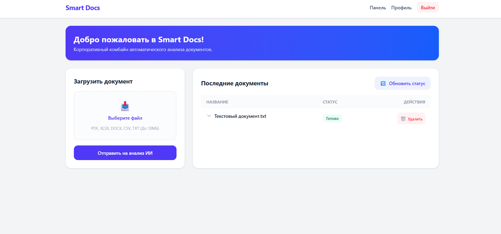
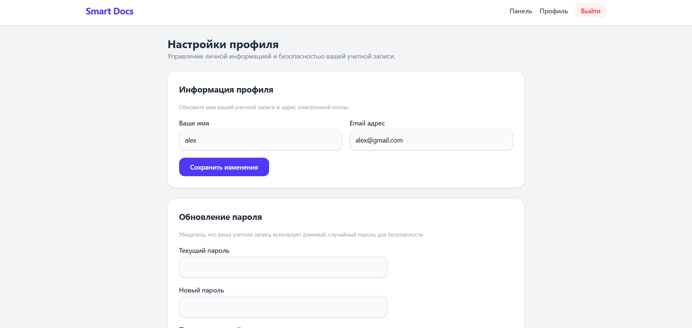
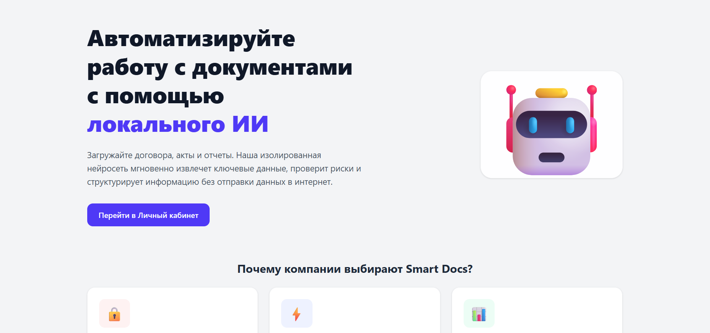
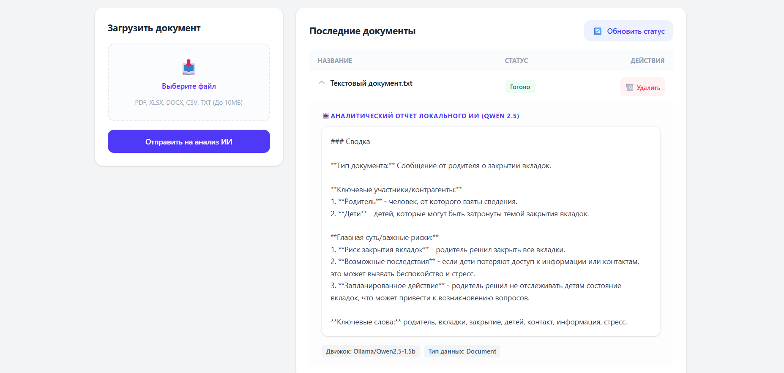

# Smart Docs — Корпоративный ИИ-Комбайн Документооборота 🤖📁

**Smart Docs** — это высокотехнологичная микросервисная система для автоматического анализа, аннотирования и структурирования корпоративных документов (договоров, актов, отчетов, таблиц) с использованием **изолированной локальной нейросети**.

Главное бизнес-преимущество платформы — **100% конфиденциальность данных**. Нейросеть развернута внутри закрытого Docker-контейнера в локальной сети компании. Ни один байт коммерческой информации или персональных данных сотрудников не отправляется в интернет.

---

## 🚀 Основные возможности (Что решает проект)

* **Автоматический разбор таблиц:** Интеграция с библиотекой `pandas` позволяет мгновенно считывать структуру файлов `.csv`, определять количество строк, колонок и типы данных.
* **Интеллектуальная суммаризация:** Локальная языковая модель **Qwen 2.5** выступает в роли корпоративного юриста — анализирует текст документа, выделяет предмет сделки, ключевых контрагентов и подсвечивает скрытые юридические риски.
* **Асинхронный фоновый бэкенд:** Тяжелые файлы обрабатываются в фоновом режиме через очереди `Redis`, не замедляя и не блокируя реактивный интерфейс пользователя.
* **Система безопасности уровня Enterprise:** Полноценное управление профилями сотрудников, строгая валидация входящих офисных форматов и защита от спама (Rate Limiting).
* **Интерфейс Mobile-First:** Адаптивный, чистый дизайн на базе Tailwind v4, оптимизированный для работы как на десктопах, так и на экранах смартфонов.

---

## 🛠 Технологический стек

Проект построен на базе распределенной микросервисной архитектуры в Docker:

* **Frontend:** PHP 8.4, Laravel 13, Livewire 4 (Полностраничные компоненты Volt), Alpine.js, Tailwind v4 CSS.
* **Backend ИИ-воркер:** Python 3.11, Pandas (анализ данных), MySQL Connector.
* **Брокер очередей:** Redis 7 (Хранение фоновых задач в JSON-формате).
* **ИИ-Движок:** Ollama + Языковая модель Qwen 2.5 (1.5B параметров, оптимизированная под CPU).
* **База данных:** MySQL 8.0.
* **Веб-сервер:** Nginx.

---

## 📐 Архитектура движения данных (Event-Driven)

1. Пользователь загружает документ на Дашборде (`Livewire 4`).
2. Laravel сохраняет файл, делает запись в MySQL и мгновенно пушит задачу в `Redis` (`ProcessDocument Job`).
3. Фоновый воркер `Python` перехватывает JSON-задачу из Redis, считывает физический файл через общий Docker-том (`Shared Volume`) и отправляет текст в ИИ-контейнер `Ollama`.
4. Модель `Qwen 2.5` генерирует краткую сводку на русском языке, Python записывает ответ напрямую в `MySQL` и переводит статус в `completed`.
5. Пользователь нажимает «Обновить статус», и Livewire реактивно перерисовывает таблицу, выводя готовый результат.

---

## 🖼 Интерфейс приложения (Скриншоты)

### 1. пример


### 2. пример


### 3. пример


### 4. пример


---

## ⚙️ Инструкция по локальному развертыванию

### 📋 Предварительные требования (Что должно быть установлено на ПК)

Перед началом установки убедитесь, что на вашей хост-машине развернуты следующие инструменты:

1. **Docker Desktop** — скачайте и установите с [официального сайта](https://docker.com). Программа должна быть запущена (иконка кита в панели задач должна гореть зелёным).
2. **Система контроля версий Git**:
   * **Windows:** Установите [Git для Windows](https://git-scm.com) (в комплекте идет терминал *Git Bash*). Также рекомендуется использовать среду *WSL2 (Ubuntu)*.
   * **Ubuntu / Debian Linux:** Выполните в консоли: `sudo apt update && sudo apt install git docker-compose -y`
   * **macOS:** Установите через терминал: `xcode-select --install`
3. **Любой современный браузер** (Google Chrome, Яндекс.Браузер, Mozilla Firefox, Microsoft Edge, Safari) для работы с интерфейсом.

---

### 1. Клонирование репозитория и настройка окружения
Откройте ваш терминал (*Git Bash*, *WSL2* или стандартную консоль Linux/Mac) и скачайте исходный код проекта на свой компьютер:
```bash
git clone https://github.com/Laracoper/my-microservices-app.git
cd my-microservices-app
```

### 2. Подготовка файлов конфигурации (.env)
По соображениям безопасности секретные ключи и пароли к базам данных не хранятся в интернете. Нам нужно активировать два файла конфигурации из шаблонов.

**1. Создание КОРНЕВОГО файла настроек Docker (в папке `my-microservices-app`):**
```bash
cp .env.example .env
```

**2. Создание файла настроек веб-приложения Laravel (в папке `src/laravel-app/`):**
```bash
cp src/laravel-app/.env.example src/laravel-app/.env
```

### 3. Запуск инфраструктуры в Docker
Запустите сборку и подъем всех микросервисов в фоновом режиме:
```bash
docker-compose up -d --build
```
*Docker автоматически прочитает корневой `.env`, настроит права пользователей, скачает веб-сервера, базы данных, настроит зеркала репозиториев (Aliyun) и поднимет Nginx на порту `8087`.*

### 4. Контейнерная установка пакетов (Composer и NPM)
Установка PHP и JS библиотек запускается напрямую внутри изолированной среды. Чтобы защитить сборку от сетевых обрывов и SSL-таймаутов провайдеров (`curl error 56`), Composer принудительно переводится в режим безопасного скачивания исходников через протокол Git:
```bash
# 1. Защищаем Composer от сетевых таймаутов при медленной связи
docker exec -it micro_laravel composer config preferred-install source

# 2. Скачиваем PHP зависимости и драйверы сокетов
docker exec -it micro_laravel composer install

# 3. Устанавливаем и компилируем фронтенд-пакеты Tailwind v4 намертво для релиза
docker exec -it micro_laravel npm install
docker exec -it micro_laravel npm run build
```

### 5. Генерируем ключи, миграции и очищаем кэш
```bash
# 1. Генерируем уникальный секретный ключ безопасности приложения
docker exec -it micro_laravel php artisan key:generate

# 2. Автоматически создаем все таблицы внутри базы данных MySQL
docker exec -it micro_laravel php artisan migrate

# 3. Сбрасываем кэш настроек фреймворка
docker exec -it micro_laravel php artisan optimize:clear
```

### 6. Скачивание ИИ-модели (Выполняется один раз)
Прикажите контейнеру Ollama скачать компактную и умную модель Qwen 2.5, которая будет работать прямо на вашем процессоре (CPU):
```bash
docker exec -it micro_ollama ollama run qwen2.5:1.5b ""
```
*Модель весит около 900 МБ. Скачивание займет 1–3 минуты. Файлы нейросети надежно сохранятся в локальную папку на вашем жестком диске (`Docker Volumes`), повторно скачивать её при последующих запусках не потребуется.*

---

### 🎉 Платформа успешно запущена!
Откройте ваш браузер и перейдите по адресу:  
👉 **http://localhost:8087**

1. Зарегистрируйте корпоративный аккаунт через кнопку **Register**.
2. Вы попадете на Дашборд. Выберите любой **CSV-файл** или текстовый документ на компьютере и нажмите **«Отправить на анализ ИИ»**.
3. Спустя 15–20 секунд нажмите кнопку **«Обновить статус»** 🔄. Плашка сменится на зеленую **«Готово»**.
4. **Кликните прямо по строке этого документа** — под ним развернется подробнейший текстовый аналитический отчет по вашему файлу, выполненный локальной нейросети без интернета!

---

### 🛑 Как правильно выключить платформу:
Чтобы освободить оперативную память компьютера, выполните команду:
```bash
docker-compose down
```
